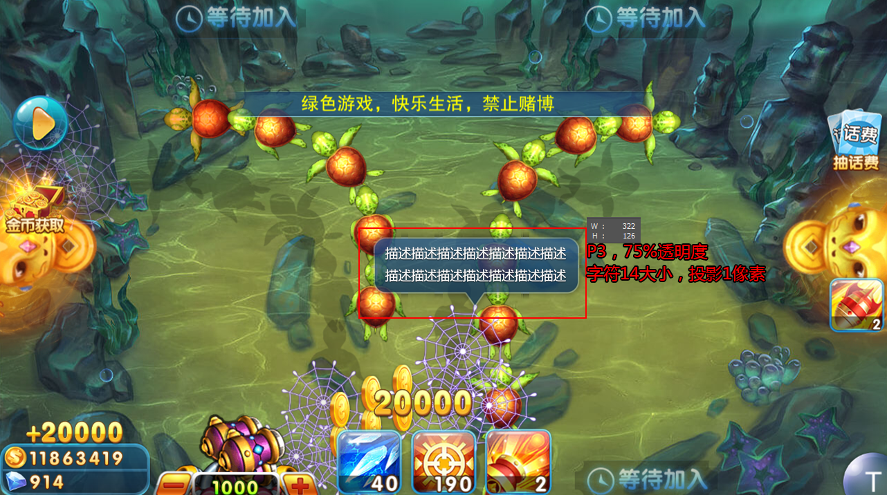
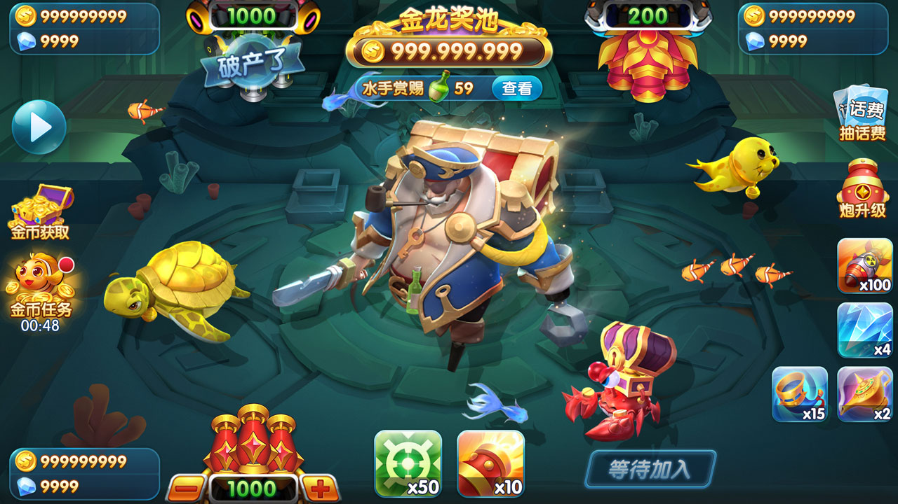
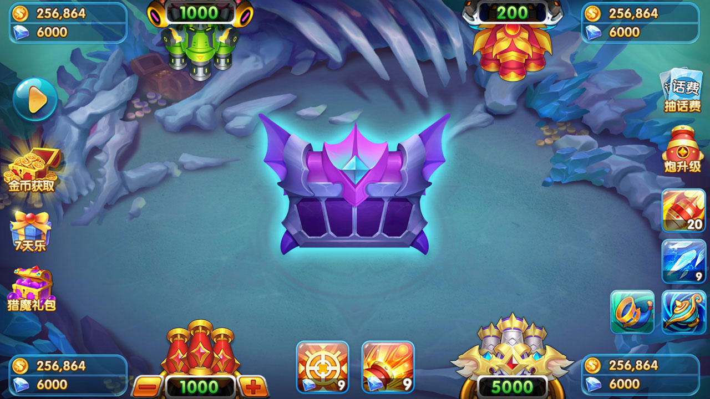
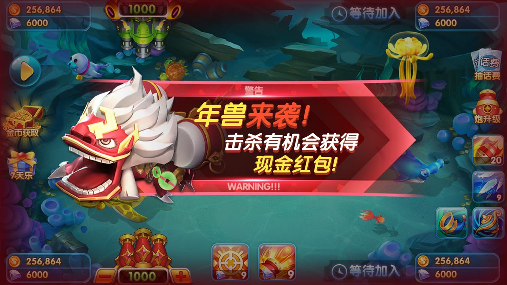

# 捕鱼游戏完整源码与美术资源

**简体中文** · [繁體中文](README.zh-TW.md) · [English](README.en.md) · [图文产品页](https://alibabama401.github.io/Fishing-Game-Complete-Source-Art/)

面向“捕鱼源码、捕鱼游戏、捕鱼大作战源码、街机捕鱼”搜索意图，展示仓库中可核实的 Cocos2d-x Lua 客户端模块、C/Android NDK 文件、捕鱼玩法与真实产品截图。

**捕鱼源码 · 捕鱼游戏 · 捕鱼大作战源码 · 街机捕鱼 · Cocos2d-x 捕鱼源码 · 捕鱼美术资源**

## 项目概览

- GitHub: https://github.com/alibabama401/Fishing-Game-Complete-Source-Art
- Pages: https://alibabama401.github.io/Fishing-Game-Complete-Source-Art/
- 展示 Cocos2d-x Lua 街机捕鱼游戏源码、美术资源、鱼群与 Boss 战斗、炮台道具、特色小游戏、登录好友模块及 Android NDK C 代码。

## 功能与玩法

| Area | Evidence-based description |
| --- | --- |
| 街机捕鱼战斗 | 鱼群、Boss、炮台升级、子弹与道具反馈等战斗界面。 |
| 特色玩法与场景 | 现有说明包含弹头夺宝、玉石场、三国主题和宠物玩法等场景。 |
| 社交与外围系统 | 公开模块覆盖登录、好友/聊天、设置、礼物兑换与协议定义。 |
| 美术与 UI 参考 | 11 张仓库内截图展示场景、HUD、鱼群、炮台、奖励与特效。 |

## 技术证据

| Evidence | What it shows |
| --- | --- |
| Cocos2d-x Lua 证据 | Lua UI 模块调用 `cc` API，并加载 CSB 界面文件。 |
| 客户端模块 | 登录、好友/聊天、设置、礼物兑换、数据和协议模块。 |
| Android 原生代码 | `Android.mk` 编译 bspatch、bzip2 等相关 C 源文件。 |
| 仓库范围 | 公开文件与截图用于技术评估；集成前应自行核对代码完整度、依赖和许可证。 |

## 产品截图

*Boss 战斗与炮台升级场景*

*鱼群、捕获网与奖励反馈*

*街机捕鱼战斗界面*

*捕鱼场景与道具控制*

*捕鱼 UI 与视觉效果*

*捕鱼小游戏界面*

*主题捕鱼玩法场景*

*捕鱼战斗美术与 HUD*

*捕鱼游戏动作场景*

*捕鱼玩法功能界面*

*玉石主题捕鱼场*

## 仓库范围

本 README 只描述公开仓库中可见的证据。集成前请核对构建依赖、完整度、许可证、安全性与素材权属。搜索可见度可以改善，但不能保证固定排名。
